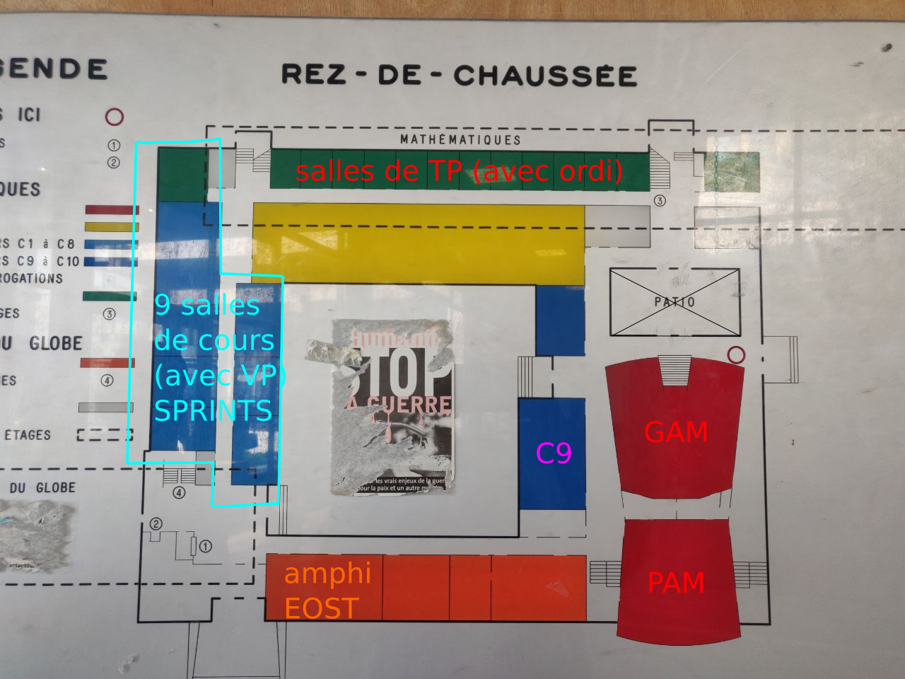
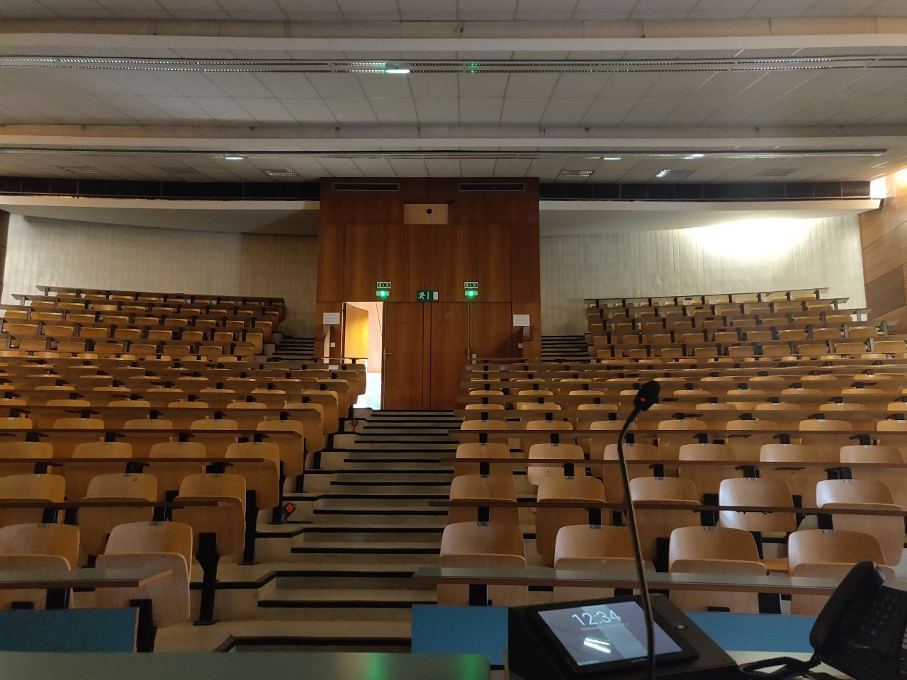
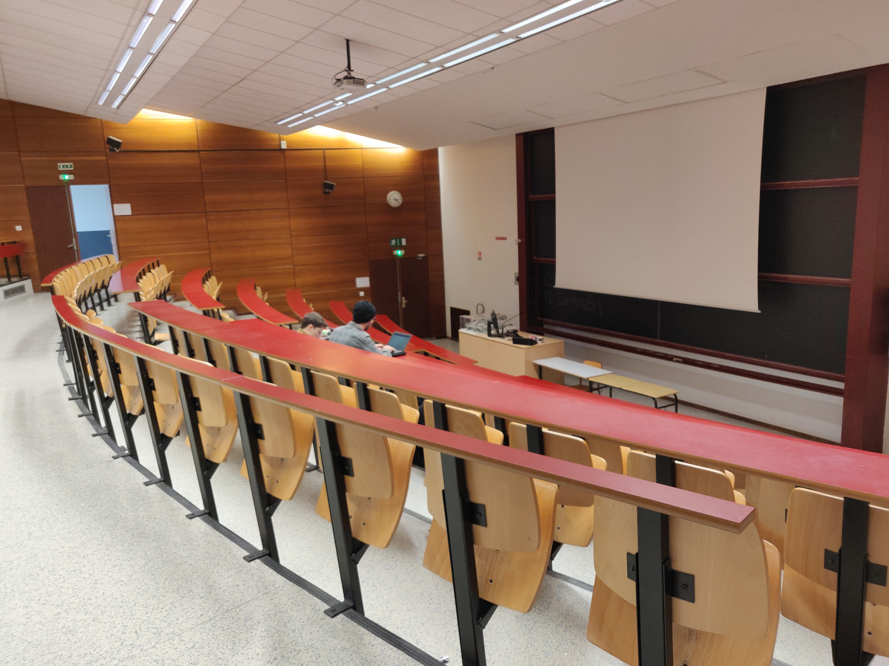
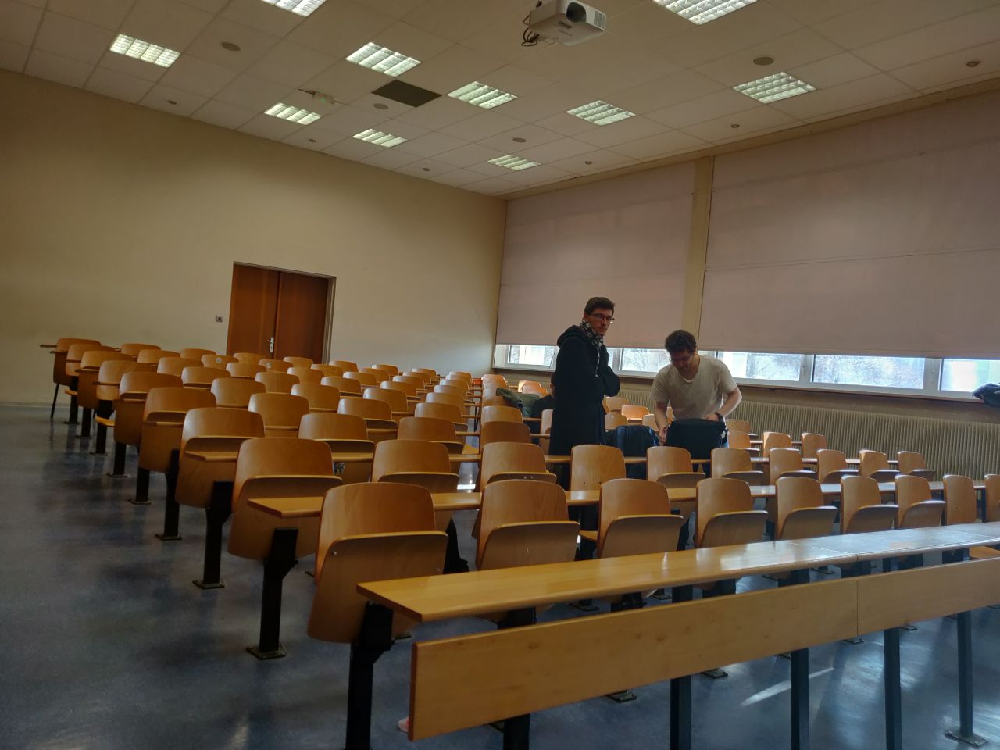
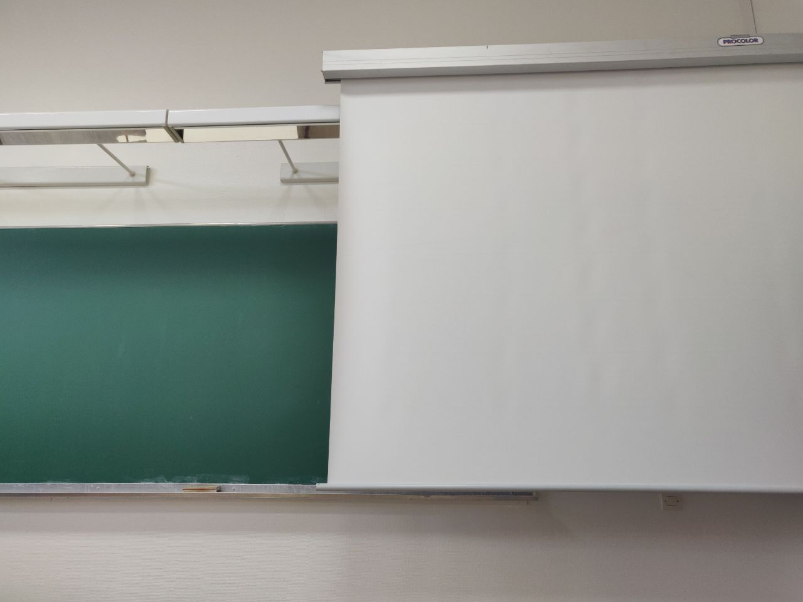
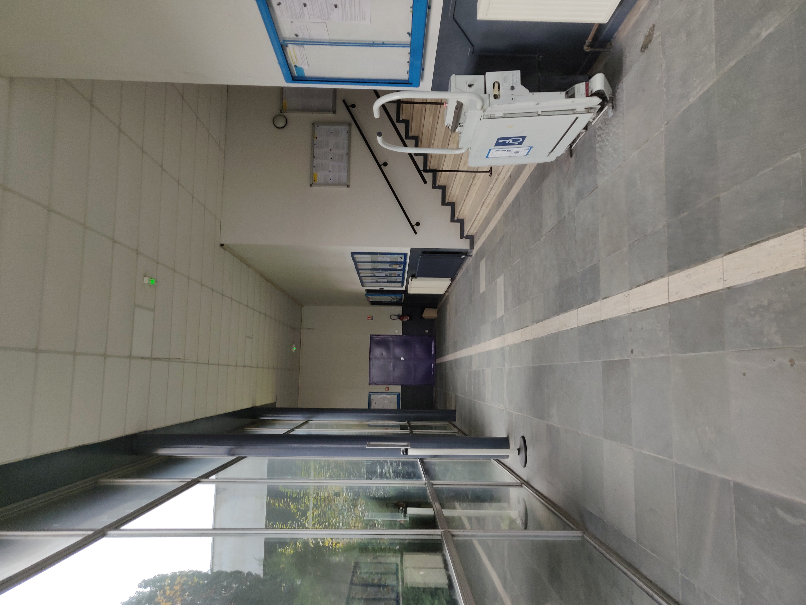
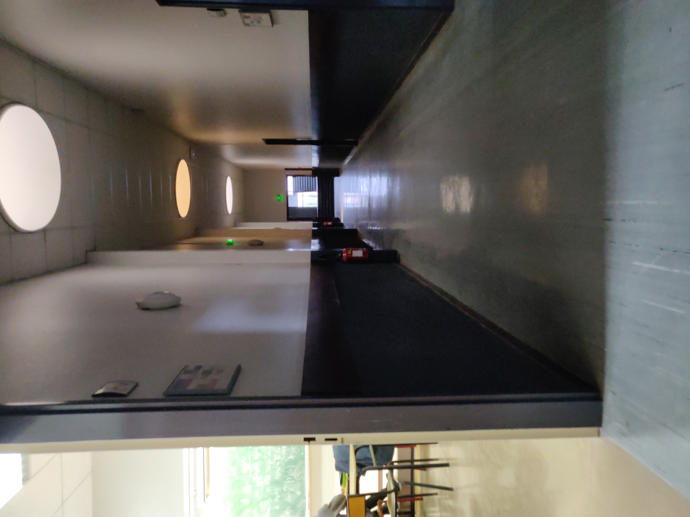

UFR de Mathématiques et Informatiques
=====================================

# Infrastructure

- [x] 2 amphithéatres de > 300 places (avec vidéo projecteur)
- [x] 2 salles de conférences / amphitéatres de >100 places (avec vidéo projecteur)
- [x] Une dizaine salles de cours/td de 30-40 places (certaines avec VP)
- [x] 1 hall d'accueil (pour acceuillir participant, pour les stands sponsors, pour les pauses cafés)
- [x] Accès wifi dans toutes les salles (ouvert sur tous les ports)
- [x] De préférence toutes les salles dans un même batiment

# Organisation

Pour l'instant ça se passe [sur ce framapad](https://bimestriel.framapad.org/p/bischheim_20pycon)

# Photos

## Plan Générale

## GAM

## PAM

## EOST

## C9

## Autre

### Pause café

### Sponsors

### Salles sprint

